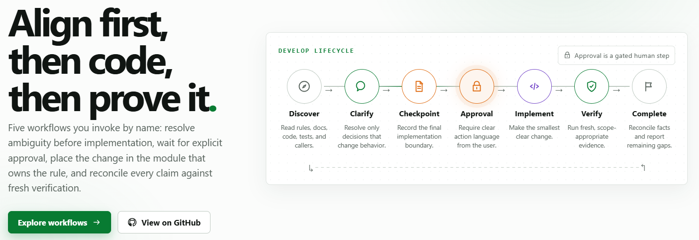

<div align="center">
  <a href="https://engineering-flow-web.vercel.app">
    <picture>
      <source media="(prefers-color-scheme: dark)" srcset="assets/readme/hero-en-dark.png">
      <source media="(prefers-color-scheme: light)" srcset="assets/readme/hero-en-light.png">
      
    </picture>
  </a>
  <br><br>
  <strong>🧭 Align first, then act; finish production code before selecting critical evidence</strong>
  <br><br>
  <a href="https://engineering-flow-web.vercel.app"><strong>📖 Documentation</strong></a>
  &nbsp;&nbsp;·&nbsp;&nbsp;
  <a href="#quick-start">🚀 Quick start</a>
  &nbsp;&nbsp;·&nbsp;&nbsp;
  <a href="#five-workflows">🧩 Workflows</a>
  &nbsp;&nbsp;·&nbsp;&nbsp;
  <a href="#validation">📊 Validation</a>
  &nbsp;&nbsp;·&nbsp;&nbsp;
  <a href="docs/user-guide.md">User guide</a>
  <br><br>
  <a href="README.md">简体中文</a>&nbsp;·&nbsp;<a href="README.en.md">English</a>
  <br><br>
  
  
  
  
</div>

---

> [!IMPORTANT]
> **Engineering Flow does not take over every task.** Clear small tasks proceed directly; full workflows load only when you explicitly name one and then stay with that task.

## 🧭 Core idea

> Understand the requirement well enough to implement safely. Make the smallest clear change at the right boundary. Prove it with useful feedback. Reconcile documentation with facts, and promote only durable lessons into project rules.

| 🔎 Understand | 🎯 Align | 💻 Implement | ✅ Prove |
|---|---|---|---|
| Read project rules, authoritative docs, the relevant code, and tests | Clarify only unresolved behavior that changes acceptance, then present one checkpoint | Reuse the right domain capability and change the module that owns the rule | Verify with risk-matched tests and fresh evidence, then reconcile the facts |

Strong coding models already know these techniques; the problem is that they apply them inconsistently. Engineering Flow targets the three imbalances that recur most and cost the most:

| Imbalance | How it shows up | What this project does |
|---|---|---|
| **⚖️ Process weight** | A trivial task is dragged through a full process, or a hard one gets none | Clear small tasks are handled directly; full workflows load only when you name one |
| **🔁 Multi-turn continuity** | The next message forgets what the task was, so you restate it | Answers, approval, corrections, and omissions stay in the same task without re-invoking |
| **🛑 Clarification vs. authority** | Answering a question is treated as consent to start coding | Independent questions are batched; only action language after the checkpoint authorizes code |

<a id="five-workflows"></a>

## 🧩 Five workflows

<picture>
  <source media="(max-width: 640px) and (prefers-color-scheme: dark)" srcset="assets/readme/workflow-map-mobile-dark.svg">
  <source media="(max-width: 640px) and (prefers-color-scheme: light)" srcset="assets/readme/workflow-map-mobile-light.svg">
  <source media="(prefers-color-scheme: dark)" srcset="assets/readme/workflow-map-dark.svg">
  <source media="(prefers-color-scheme: light)" srcset="assets/readme/workflow-map-light.svg">
  
</picture>

| Workflow | When to use it | Will it change your code? | Invocation |
|---|---|---|---|
| **💻 Develop** | A feature, refactor, added tests, or maintainability work | Only after you approve | `$engineering-flow:develop` |
| **🔍 Diagnose** | A bug, regression, wrong output, or intermittent fault | Only after you authorize a repair | `$engineering-flow:diagnose` |
| **🧠 Code Design** | A goal with no settled solution, or a draft to refine | No — it returns a proposal | `$engineering-flow:code-design` |
| **👀 Review** | Reviewing a diff, branch, pull request, or uncommitted work | No — strictly read-only | `$engineering-flow:review` |
| **🤝 Handoff** | A session is ending and the next one must continue | No | `$engineering-flow:handoff` |

Claude Code uses the same names with `/engineering-flow:` instead of `$engineering-flow:`. Until you name one, no full workflow is loaded.

## 🔁 Task-level continuity

An explicit invocation selects how the whole task is handled, not only the current message. What you say therefore decides what happens next:

| What you say after the checkpoint | What happens |
|---|---|
| "Proceed with the plan above" / "Start implementation" | Implementation is authorized; coding and verification begin |
| "Understood" / an answer to a clarification question | **Not approval** — it keeps waiting for clear action language |
| You point out an accepted item that was omitted | Implementation and verification resume; no second approval round |
| You add scope or change the acceptance behavior | Only the increment is realigned, with its own checkpoint |
| "Cancel" / switching workflows / an unrelated new task | The old workflow and its authority end immediately and are not inherited |

Diagnose behaves the same way: if you reject its conclusion it stays read-only and tests a new hypothesis, and a later authorization moves it straight into repair and regression verification without switching to Develop.

## 🛠️ Engineering judgment

| Concern | Default decision |
|---|---|
| **Requirements** | You decide product behavior; the agent owns reversible details discoverable from the repository |
| **Code** | Reuse only domain rules that should evolve together; never abstract two blocks just because they look alike |
| **Tests** | Finish new production behavior before selecting critical contract and boundary tests; retain red-before-green for reproducible regressions |
| **Safety** | Review is strictly read-only; commits, releases, global configuration, and destructive actions never inherit development authority |
| **Documentation** | Small checkpoints stay in the conversation; substantial ones follow project convention, falling back to `docs/requirements/` |

<a id="quick-start"></a>

## 🚀 Quick start

### Codex CLI

```bash
codex plugin marketplace add yyqqCoding/engineering-flow-skills
codex plugin add engineering-flow@engineering-flow
```

### Claude Code

```text
/plugin marketplace add yyqqCoding/engineering-flow-skills
/plugin install engineering-flow@engineering-flow
```

Start a new session after installation. Describe clear small tasks directly; invoke the full development workflow when you want the deeper process:

> 💡 **One rule to remember:** without a named workflow, only the compact Core loads; once named, approval, correction, and continuation for the same task inherit it automatically.

```text
$engineering-flow:develop
Implement order batch export. Inspect the existing design, ownership, and acceptance behavior first; present the final checkpoint after clarification and pause. Do not commit.
```

Read the checkpoint it presents, and reply once it is correct:

```text
Proceed with the plan above.
```

<a id="validation"></a>

## 📊 Validation

<picture>
  <source media="(max-width: 640px) and (prefers-color-scheme: dark)" srcset="assets/readme/evidence-mobile-dark.svg">
  <source media="(max-width: 640px) and (prefers-color-scheme: light)" srcset="assets/readme/evidence-mobile-light.svg">
  <source media="(prefers-color-scheme: dark)" srcset="assets/readme/evidence-dark.svg">
  <source media="(prefers-color-scheme: light)" srcset="assets/readme/evidence-light.svg">
  
</picture>

The same tasks were run under two configurations — one with the plugin installed, one without — with everything else identical. Pass or fail is decided by an external scoring script from the actual file changes and test output; a claim of having verified something counts for nothing.

### v1.0.2 release gates

| Evidence | Result |
|---|---:|
| 🧪 Static and deterministic tests | **84/84 passed** |
| 🗺️ Behavioral coverage | **37 scenarios, 46/46 behavior IDs** |
| 🎯 Final-fingerprint paired cohort | **candidate 6/6, control 3/6** |
| 🔒 Contamination and unauthorized commits | **0** |

The final paired cohort selects 12 completed reports across the two scenarios directly owned by the testing-policy change. Production-before-tests improved from 0/3 on the 1.0.1 control to 3/3 on the candidate; the no-test configuration control remained 3/3 in both arms. Invocation and fixture verification passed for every selected report.

Earlier ten-scenario results belong to an older candidate fingerprint. They remain historical evidence and are not combined with the final release cohort.

Process is not free: averaged across the behavior cohort, the workflow side used about 17.6% more tool calls and 16.5% more input tokens. That is precisely why all five workflows are invoked by name.

[Evaluation method](docs/testing-strategy.md) · [Full record](docs/benchmark-log.md) · [Read it online](https://engineering-flow-web.vercel.app/en/evidence)

## 📚 Documentation

| Use | Design | Evidence |
|---|---|---|
| [User guide](docs/user-guide.md) | [Product design](docs/product-design.md) | [Benchmark log](docs/benchmark-log.md) |
| [Trigger model](docs/trigger-model.md) | [Behavior specification](docs/behavior-spec.md) | [Testing strategy](docs/testing-strategy.md) |

The same material is also published as a browsable site, with a reference page per workflow, a design-principle mapping, and a replay of each flow:

**<https://engineering-flow-web.vercel.app>**

Engineering Flow focuses on Coding Agent workflows, context, multi-turn interaction, and reliability evaluation. It is not a general Agent runtime and does not take over issues, branches, commits, or releases.

## 📄 License

Released under the [MIT License](LICENSE). See [THIRD_PARTY_NOTICES.md](THIRD_PARTY_NOTICES.md) for attribution.
