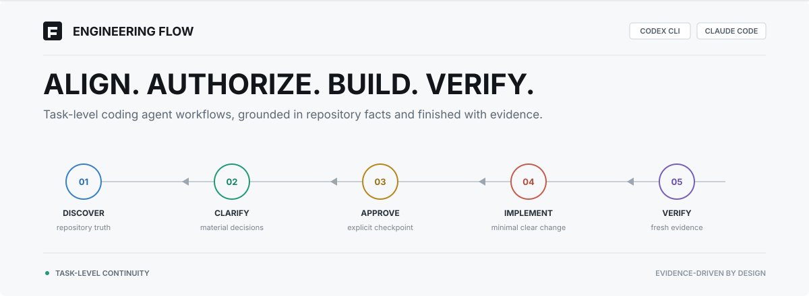
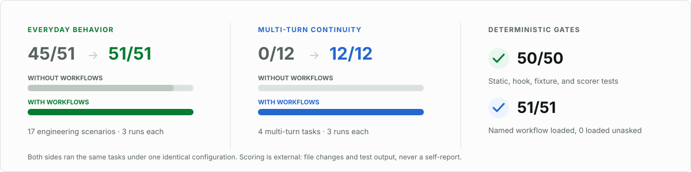

<div align="center">
  <picture>
    <source media="(max-width: 640px) and (prefers-color-scheme: dark)" srcset="assets/readme/hero-mobile-dark.svg">
    <source media="(max-width: 640px) and (prefers-color-scheme: light)" srcset="assets/readme/hero-mobile-light.svg">
    <source media="(prefers-color-scheme: dark)" srcset="assets/readme/hero-dark.svg">
    <source media="(prefers-color-scheme: light)" srcset="assets/readme/hero-light.svg">
    
  </picture>
  <br><br>
  <strong>Task-level development workflows and evaluation for Codex CLI and Claude Code</strong>
  <br><br>
  <a href="#quick-start"><strong>Quick start</strong></a>
  &nbsp;&nbsp;·&nbsp;&nbsp;
  <a href="#five-workflows">Workflows</a>
  &nbsp;&nbsp;·&nbsp;&nbsp;
  <a href="#validation">Validation</a>
  &nbsp;&nbsp;·&nbsp;&nbsp;
  <a href="docs/user-guide.md">User guide</a>
  <br><br>
  <a href="README.md">简体中文</a>&nbsp;·&nbsp;<a href="README.en.md">English</a>
  <br><br>
  
  
  
</div>

---

## Core idea

> Understand the requirement well enough to implement safely. Make the smallest clear change at the right boundary. Prove it with useful feedback. Reconcile documentation with facts, and promote only durable lessons into project rules.

| Understand | Align | Implement | Prove |
|---|---|---|---|
| Read project rules, authoritative docs, code, and tests | Clarify only unresolved behavior that changes acceptance, then present one checkpoint | Reuse the right domain capability and change the owning module | Verify with risk-matched tests and fresh evidence, then reconcile facts |

Engineering Flow addresses three recurring Coding Agent failures:

- **Mismatched process:** clear tasks stay direct; full workflows load only when explicitly selected.
- **Broken multi-turn continuity:** answers, approval, corrections, and omissions remain in the same task without repeating the invocation.
- **Confused clarification and authority:** independent questions are batched, dependent questions are sequenced, and answers do not authorize implementation.

## Five workflows

| Workflow | Delivery | Codex invocation |
|---|---|---|
| **Develop** | Align requirements, await approval, then implement, test, and reconcile docs | `$engineering-flow:develop` |
| **Diagnose** | Reproduce and locate the cause, then repair and regression-test when authorized | `$engineering-flow:diagnose` |
| **Code Design** | Create or refine an implementable proposal without production code | `$engineering-flow:code-design` |
| **Review** | Perform a strict read-only review of a diff, branch, or uncommitted work | `$engineering-flow:review` |
| **Handoff** | Preserve the minimum task state required by another session | `$engineering-flow:handoff` |

Claude Code uses the same names with `/engineering-flow:` instead of `$engineering-flow:`.

## Task-level continuity

An explicit invocation selects how the whole task is handled, not only the current message:

```text
discover & clarify ──► final checkpoint ──► await approval ──► implement & verify ──► complete
          ▲                                         │                              │
          └────── added scope aligns increment ─────┘                              │
                                 omitted acceptance resumes implementation ◄──────┘
```

- “Proceed with the plan above” may approve implementation after the final checkpoint; a reading acknowledgement or clarification answer cannot.
- When a diagnosis is rejected, Diagnose remains read-only and tests a new hypothesis. Repair authorization does not require switching to Develop.
- Explicit cancellation, workflow switching, or an unrelated task ends the old workflow and authority.

## Engineering judgment

| Concern | Default decision |
|---|---|
| **Requirements** | Users decide product behavior; agents own reversible details discoverable from the repository |
| **Code** | Reuse domain rules that should evolve together; do not abstract merely similar code |
| **Tests** | Prefer red-green evidence for regressions and high-risk behavior; use direct validation for mechanical work |
| **Safety** | Review is read-only; commits, releases, global configuration, and destructive actions require their own authority |
| **Documentation** | Keep small checkpoints in the conversation; follow project conventions for substantial requirements, falling back to `docs/requirements/` |

## Quick start

### Codex CLI

```bash
codex plugin marketplace add yyqqCoding/engineering-flow-skills
codex plugin add engineering-flow@engineering-flow
```

### Claude Code

```text
/plugin marketplace add yyqqCoding/engineering-flow-skills
/plugin install engineering-flow@engineering-flow
```

Start a new session after installation. Describe clear small tasks directly; explicitly invoke the full development workflow when needed:

```text
$engineering-flow:develop
Implement order batch export. Inspect the existing design, ownership, and acceptance behavior first; present the final checkpoint after clarification and pause. Do not commit.
```

After reading the checkpoint, reply:

```text
Proceed with the plan above.
```

## Validation

<picture>
  <source media="(max-width: 640px) and (prefers-color-scheme: dark)" srcset="assets/readme/evidence-mobile-dark.svg">
  <source media="(max-width: 640px) and (prefers-color-scheme: light)" srcset="assets/readme/evidence-mobile-light.svg">
  <source media="(prefers-color-scheme: dark)" srcset="assets/readme/evidence-dark.svg">
  <source media="(prefers-color-scheme: light)" srcset="assets/readme/evidence-light.svg">
  
</picture>

[Evaluation method](docs/testing-strategy.md) · [Full benchmark record](docs/benchmark-log.md)

## Documentation

| Use | Design | Evidence |
|---|---|---|
| [User guide](docs/user-guide.md) | [Product design](docs/product-design.md) | [Benchmark log](docs/benchmark-log.md) |
| [Trigger model](docs/trigger-model.md) | [Behavior specification](docs/behavior-spec.md) | [Testing strategy](docs/testing-strategy.md) |

Engineering Flow focuses on Coding Agent workflows, context, multi-turn interaction, and reliability evaluation. It is not a general Agent runtime and does not take over issues, branches, commits, or releases.

## License

Released under the [MIT License](LICENSE). See [THIRD_PARTY_NOTICES.md](THIRD_PARTY_NOTICES.md) for attribution.
