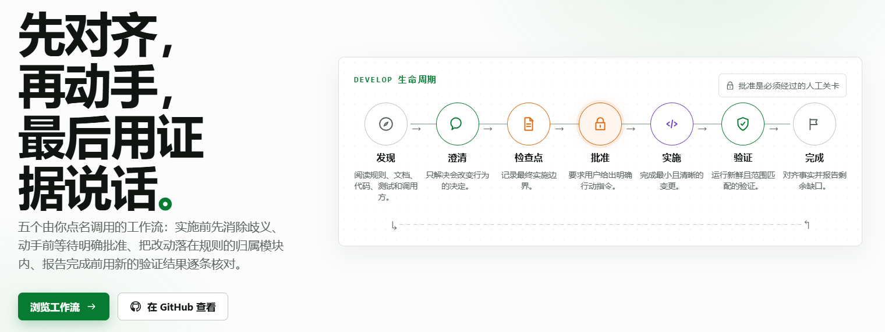
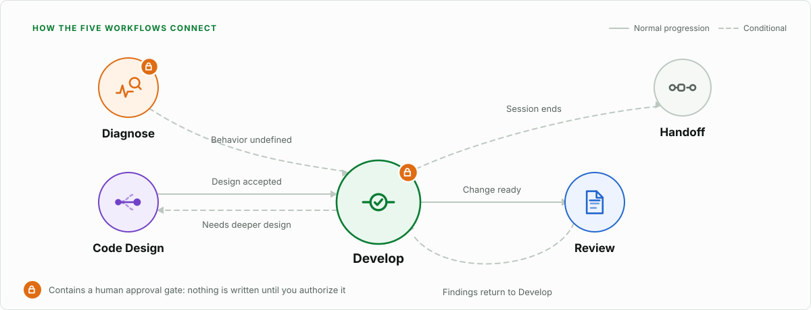

<div align="center">
  <a href="https://engineering-flow-web.vercel.app">
    <picture>
      <source media="(prefers-color-scheme: dark)" srcset="assets/readme/hero-zh-dark.png">
      <source media="(prefers-color-scheme: light)" srcset="assets/readme/hero-zh-light.png">
      
    </picture>
  </a>
  <br><br>
  <strong>🧭 先对齐，再动手；先完成生产代码，再补关键证据</strong>
  <br><br>
  <a href="https://engineering-flow-web.vercel.app"><strong>📖 在线文档</strong></a>
  &nbsp;&nbsp;·&nbsp;&nbsp;
  <a href="#快速开始">🚀 快速开始</a>
  &nbsp;&nbsp;·&nbsp;&nbsp;
  <a href="#五个工作流">🧩 工作流</a>
  &nbsp;&nbsp;·&nbsp;&nbsp;
  <a href="#验证结果">📊 验证结果</a>
  &nbsp;&nbsp;·&nbsp;&nbsp;
  <a href="docs/user-guide.zh-CN.md">用户指南</a>
  <br><br>
  <a href="README.md">简体中文</a>&nbsp;·&nbsp;<a href="README.en.md">English</a>
  <br><br>
  
  
  
  
</div>

---

> [!IMPORTANT]
> **Engineering Flow 不会接管所有任务。** 清晰的小任务直接完成；只有你显式点名时，完整工作流才会加载并持续负责同一个任务。

## 🧭 核心思想

> 先把需求理解到足以安全实施，再在正确边界写最小但清晰的代码，用有效反馈证明它工作，最后让文档反映事实、让项目规则只沉淀长期经验。

| 🔎 理解 | 🎯 确认 | 💻 实施 | ✅ 证明 |
|---|---|---|---|
| 读项目规则、权威文档、相关代码与测试 | 只澄清会改变验收结果的未决行为，然后给出一个检查点 | 复用正确的领域能力，在拥有该规则的模块内完成最小改动 | 用与风险匹配的测试和新鲜证据验证，并让文档反映事实 |

强编码模型已经掌握这些工程技巧，问题在于应用不稳定。Engineering Flow 只针对其中三种反复出现、代价最高的失衡：

| 失衡 | 表现 | 本项目的处理 |
|---|---|---|
| **⚖️ 流程强度** | 简单任务被拖进完整流程，或复杂任务没有流程 | 清晰的小任务直接完成；完整工作流只在你点名时加载 |
| **🔁 多轮连续性** | 换一条消息就忘了在做什么，需要重复交代 | 回答、批准、纠正、补漏都留在同一个任务里，不必重复调用 |
| **🛑 澄清与授权** | 把"回答了问题"当成"同意开工" | 独立问题批量问完；只有检查点之后的行动指令才授权编码 |

<a id="五个工作流"></a>

## 🧩 五个工作流

<picture>
  <source media="(max-width: 640px) and (prefers-color-scheme: dark)" srcset="assets/readme/workflow-map-mobile-dark.svg">
  <source media="(max-width: 640px) and (prefers-color-scheme: light)" srcset="assets/readme/workflow-map-mobile-light.svg">
  <source media="(prefers-color-scheme: dark)" srcset="assets/readme/workflow-map-dark.svg">
  <source media="(prefers-color-scheme: light)" srcset="assets/readme/workflow-map-light.svg">
  
</picture>

| 工作流 | 什么时候用它 | 会改你的代码吗 | 调用 |
|---|---|---|---|
| **💻 Develop** | 新功能、重构、补测试、代码完善 | 你批准之后才改 | `$engineering-flow:develop` |
| **🔍 Diagnose** | bug、回归、错误输出、间歇故障 | 你授权修复之后才改 | `$engineering-flow:diagnose` |
| **🧠 Code Design** | 有目标但方案未定，或已有设计需要完善 | 不改，只产出方案 | `$engineering-flow:code-design` |
| **👀 Review** | 评审 diff、分支、PR 或未提交改动 | 不改，严格只读 | `$engineering-flow:review` |
| **🤝 Handoff** | 会话结束，需要让下一会话接着做 | 不改 | `$engineering-flow:handoff` |

Claude Code 使用相同名称，把 `$engineering-flow:` 换成 `/engineering-flow:`。未点名时，任何完整工作流都不会加载。

## 🔁 任务级连续性

显式调用选择的是整个任务的处理方式，而不只是约束当前这条消息。因此"你说了什么"直接决定"接下来会发生什么"：

| 你在检查点之后说 | 会发生什么 |
|---|---|
| "按上述方案执行" / "开始实施" | 授权实施，进入编码与验证 |
| "已阅读" / 回答澄清问题 | **不构成批准**，继续等待明确指令 |
| 指出原验收项被漏掉了 | 直接恢复实施与验证，不再重新走一遍批准 |
| 提出新的范围或改变验收行为 | 只就新增部分重新对齐，并给出增量检查点 |
| "取消" / 切换工作流 / 开始无关的新任务 | 旧工作流与旧授权立即结束，不会被继承 |

Diagnose 的连续性同理：你否定它的诊断结论时，它保持只读并验证新假设；你之后授权修复，它直接进入修复与回归验证，不需要切换到 Develop。

## 🛠️ 工程判断

| 关注点 | 默认决策 |
|---|---|
| **需求** | 产品行为由你决定；可从仓库发现的可逆实现细节由 Agent 自主处理 |
| **代码** | 只复用应当共同演进的领域规则；不因为两段代码看起来像就强行抽象 |
| **测试** | 新行为先完成生产代码，再选择关键契约与边界测试；可稳定复现的回归保留先红后绿 |
| **安全** | Review 严格只读；提交、发布、全局配置和破坏性操作不继承开发授权 |
| **文档** | 小需求在对话里确认；大需求遵循项目约定，没有约定时落到 `docs/requirements/` |

<a id="快速开始"></a>

## 🚀 快速开始

### Codex CLI

```bash
codex plugin marketplace add yyqqCoding/engineering-flow-skills
codex plugin add engineering-flow@engineering-flow
```

### Claude Code

```text
/plugin marketplace add yyqqCoding/engineering-flow-skills
/plugin install engineering-flow@engineering-flow
```

安装后开启新会话。清晰的小任务直接描述即可；需要完整开发流程时显式调用：

> 💡 **记住一个原则：** 不点名工作流，就只有精简 Core；点名一次后，同一任务的批准、纠正和继续都会自动继承。

```text
$engineering-flow:develop
实现订单批量导出。先检查现有设计、代码边界和验收行为；完成澄清后给出最终检查点并暂停。不要提交。
```

读完它给出的检查点，确认无误后回复：

```text
按上述方案执行。
```

<a id="验证结果"></a>

## 📊 验证结果

<picture>
  <source media="(max-width: 640px) and (prefers-color-scheme: dark)" srcset="assets/readme/evidence-mobile-dark.svg">
  <source media="(max-width: 640px) and (prefers-color-scheme: light)" srcset="assets/readme/evidence-mobile-light.svg">
  <source media="(prefers-color-scheme: dark)" srcset="assets/readme/evidence-dark.svg">
  <source media="(prefers-color-scheme: light)" srcset="assets/readme/evidence-light.svg">
  
</picture>

同一批任务在两组配置下各跑一遍：一组装了本插件，一组没装，其余条件完全一致。是否通过由外部评分脚本判定，依据是实际的文件变更与测试输出，不接受"我已验证"这类自述。

### v1.0.3 发布门禁

| 证据 | 结果 |
|---|---:|
| 🧪 静态与确定性测试 | **84/84 通过** |
| 🗺️ 行为覆盖 | **37 个场景，47/47 行为 ID** |
| 🎯 最终指纹配对 cohort | **candidate 18/18，control 17/18** |
| 🔒 污染与未授权提交 | **0** |

最终配对 cohort 精确选择本次 Test Contract 直接相关的六个场景、共 36 个完整报告。candidate 六个场景均为 3/3；control 为 17/18，其中唯一失败属于旧版本 control 的初始批准措辞。所有入选样本的调用与 fixture 验证均通过。

此前的 1.0.2 及中间 candidate cohort 属于更早的候选指纹，保留为历史证据但不与最终发布结果合并。

流程本身有成本：在行为对照组上取平均，安装工作流的一组工具调用多约 17.6%、输入 token 多约 16.5%。这正是五个工作流都必须点名调用的原因。

[评测方法](docs/testing-strategy.md) · [完整记录](docs/benchmark-log.md) · [在线查看](https://engineering-flow-web.vercel.app/zh-CN/evidence)

## 📚 文档

| 使用 | 设计 | 证据 |
|---|---|---|
| [用户指南](docs/user-guide.zh-CN.md) | [产品设计](docs/product-design.md) | [基准记录](docs/benchmark-log.md) |
| [触发模型](docs/trigger-model.md) | [行为规范](docs/behavior-spec.md) | [测试策略](docs/testing-strategy.md) |

同样的内容也有一份可浏览的在线版本，含五个工作流的逐条详解、设计原则对照和流程回放演示：

**<https://engineering-flow-web.vercel.app>**

Engineering Flow 聚焦 Coding Agent 的工作流、上下文、多轮交互和可靠性评测，不是通用 Agent Runtime，也不接管项目的 Issue、分支、提交和发布流程。

## 📄 许可

项目采用 [MIT License](LICENSE)。相关项目归属见 [THIRD_PARTY_NOTICES.md](THIRD_PARTY_NOTICES.md)。
